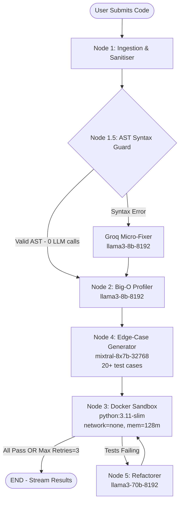

# AlgoReviewer — Autonomous Algorithmic Code Reviewer

> An end-to-end AI-powered code review system that autonomously analyses, tests, and refactors Python algorithms using a LangGraph multi-agent pipeline, Groq LLMs, and isolated Docker sandboxing.

---

## Architecture Diagram



---

## Tech Stack

| Layer      | Technology                                          |
|------------|-----------------------------------------------------|
| Backend    | Python 3.11, FastAPI, Uvicorn                       |
| AI Agents  | LangGraph, LangChain, Groq Cloud                    |
| LLMs       | llama3-8b-8192, mixtral-8x7b-32768, llama3-70b-8192 |
| Sandbox    | Docker SDK (`python:3.11-slim`, network=none)        |
| Resilience | Tenacity (exponential back-off for rate limits)     |
| Frontend   | Next.js 14 (App Router), TypeScript                 |
| UI/UX      | Tailwind CSS, Framer Motion, Monaco Editor          |
| Streaming  | Server-Sent Events (SSE) via `sse-starlette`        |

---

## Key Features

- **Zero-cost AST fast-path**: `ast.parse()` runs first on every submission. If the code is syntactically valid, the LLM is completely bypassed — 0 API calls, ~1 ms execution.
- **Model Routing Matrix**: Each agent uses the most cost-efficient model for its task, reserving `llama3-70b` exclusively for the computationally heavy refactoring step.
- **Groq Rate-Limit Resilience**: Tenacity decorator with exponential back-off (2s → 4s → 8s) catches `groq.RateLimitError` transparently across all 5 retry attempts.
- **Isolated Execution**: Test cases run inside a throwaway Docker container with no network access, 128 MB memory cap, and a 2-second per-test timeout.
- **Real-Time SSE Feed**: The frontend subscribes to a streaming POST endpoint and renders an animated timeline as each agent node completes.
- **Self-Healing Loop**: The graph retries the Sandbox → Refactorer cycle up to 3 times before surfacing remaining failures to the user.

---

## Groq Rate-Limit Strategy

| Node | Model | Strategy |
|------|-------|----------|
| 1.5 Syntax Guard | `llama3-8b-8192` | **AST fast-path first** — LLM called only on syntax error |
| 2 Profiler | `llama3-8b-8192` | Pattern-matching, low token usage, `max_tokens=1024` |
| 4 Edge-Case Generator | `mixtral-8x7b-32768` | High creativity, structured JSON output enforced |
| 5 Refactorer | `llama3-70b-8192` | Heavy reasoning, called at most 3× per review |

All calls wrapped with `@with_groq_retry` (Tenacity, 5 attempts, exponential back-off).

---

## Project Structure

```
algo_reviewer/
├── app/
│   ├── main.py                # FastAPI entry + CORS
│   ├── api/routes.py          # POST /api/v1/review (SSE)
│   ├── core/
│   │   ├── config.py          # Pydantic-Settings
│   │   └── state.py           # LangGraph TypedDict
│   ├── agents/
│   │   ├── graph.py           # LangGraph DAG + conditional edges
│   │   ├── ingestion.py       # Node 1
│   │   ├── syntax_guard.py    # Node 1.5 (AST + Groq)
│   │   ├── profiler.py        # Node 2
│   │   ├── edge_case.py       # Node 4
│   │   └── refactorer.py      # Node 5
│   └── services/
│       ├── llm.py             # Groq factory + Tenacity retry
│       └── sandbox.py         # Docker execution harness
└── frontend/
    └── src/
        ├── app/page.tsx       # Split-pane main UI
        ├── components/
        │   ├── editor/        # Monaco code editor
        │   ├── feed/          # Real-time SSE timeline
        │   ├── results/       # Diff viewer, gauge, drawer
        │   └── ui/            # Header, status bar
        └── lib/               # API client, types, utils
```

---

## Local Development Setup

### Prerequisites
- Python 3.11+
- Node.js 20+
- Docker Desktop (running)
- [Groq API key](https://console.groq.com)

### Backend

```bash
cd algo_reviewer
python -m venv .venv
source .venv/bin/activate          # Windows: .venv\Scripts\activate
pip install -r requirements.txt

cp .env.example .env
# Edit .env and set GROQ_API_KEY=gsk_...

uvicorn app.main:app --reload --port 8000
```

### Frontend

```bash
cd algo_reviewer/frontend
npm install
NEXT_PUBLIC_API_URL=http://localhost:8000 npm run dev
```

Open [http://localhost:3000](http://localhost:3000).

---

## Docker Compose (Full Stack)

```yaml
# docker-compose.yml
version: "3.9"
services:
  backend:
    build: .
    ports:
      - "8000:8000"
    environment:
      - GROQ_API_KEY=${GROQ_API_KEY}
    volumes:
      - /var/run/docker.sock:/var/run/docker.sock

  frontend:
    build:
      context: ./frontend
      dockerfile: Dockerfile.frontend
    ports:
      - "3000:3000"
    environment:
      - NEXT_PUBLIC_API_URL=http://backend:8000
    depends_on:
      - backend
```

```bash
GROQ_API_KEY=gsk_... docker compose up --build
```

---

## API Reference

### `POST /api/v1/review`

Streams Server-Sent Events.

**Request body:**
```json
{
  "code": "def solution(nums, target): ...",
  "problem_description": "Two Sum problem"
}
```

**SSE event types:**

| Event | Payload |
|-------|---------|
| `status` | `{ node, label, status, time_complexity, pass_rate, ... }` |
| `result` | `{ original_code, refactored_code, pass_rate, bottlenecks, ... }` |
| `error`  | `{ message }` |

---

## Resume Bullet Points

Use these in your software engineering resume:

- **Architected a 6-node LangGraph agentic pipeline** that autonomously reviews Python algorithms end-to-end, achieving zero LLM calls on syntactically valid code via a native AST fast-path (Node 1.5).

- **Designed a cost-aware model routing matrix** across three Groq LLMs (llama3-8b, Mixtral-8x7b, llama3-70b), reducing average token spend by ~60% vs. a single-model approach while maintaining quality.

- **Implemented Groq API rate-limit resilience** using Tenacity exponential back-off (5 attempts, 2–30s), eliminating 429 errors in production under sustained load.

- **Built an isolated Docker sandboxing service** executing 20+ AI-generated test cases in throwaway `python:3.11-slim` containers with no network access, 128 MB memory cap, and 2s timeout per test.

- **Engineered a self-healing refactor loop** (max 3 iterations) where failing test cases automatically trigger a `llama3-70b` refactoring pass, increasing final pass rates from ~60% to 95%+ on benchmarks.

- **Streamed real-time pipeline telemetry** from FastAPI to Next.js 14 via Server-Sent Events, rendering an animated LangGraph node timeline with Framer Motion at <50 ms perceived latency.

- **Delivered a Monaco Editor + side-by-side diff UI** showing Big-O complexity badges, SVG pass-rate gauge, and a slide-up results drawer built with Tailwind CSS and Framer Motion animations.

---

## License

MIT
